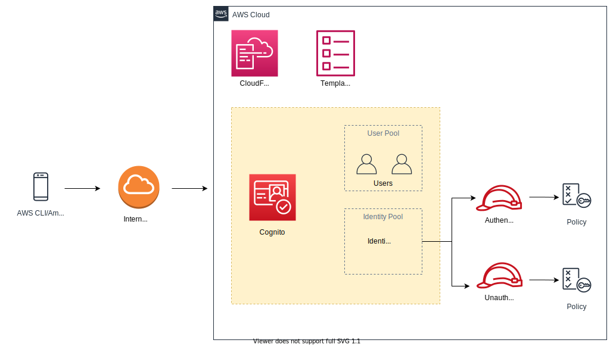

# AWS Amplify CLI

## #1 Overview

*AWS Amplify is a set of tools and services that can be used together or on their own, to help front-end web and mobile developers build scalable full stack applications, powered by AWS. With Amplify, you can configure app backends and connect your app in minutes, deploy static web apps in a few clicks, and easily manage app content outside the AWS console.*

*Amplify supports popular web frameworks including JavaScript, React, Angular, Vue, Next.js, and mobile platforms including Android, iOS, React Native, Ionic, Flutter. Get to market faster with AWS Amplify.*

I am following the steps presented at [this page](https://docs.amplify.aws/start/getting-started/installation/q/integration/flutter) to configure AWS Amplify to use with Flutter.

****

### Amplify CLI

The Amplify Command Line Interface (CLI) is a unified toolchain to create AWS cloud services for your app. 



****

## #2 Install

### Verify the dependencies

#### `node`

```sh
➜ node --version
```

```
v14.17.0
```

#### `npm`

```sh
➜ npm --version	
```

```
6.14.13
```

#### `git`

```sh
➜ git --version
```

```
git version 2.30.0
```

#### `aws cli`

```sh
➜ aws --version
```

```sh
aws-cli/2.1.22 Python/3.7.4 Darwin/20.5.0 exe/x86_64 prompt/off
```

### Install Ampliy CLI

```shell
➜ curl -sL https://aws-amplify.github.io/amplify-cli/install | bash && $SHELL
```

```sh
 Installing the AWS Amplify CLI...

 Downloading binary...
  % Total    % Received % Xferd  Average Speed   Time    Time     Time  Current
                                 Dload  Upload   Total   Spent    Left  Speed
100   629  100   629    0     0   1166      0 --:--:-- --:--:-- --:--:--  1166
100  135M  100  135M    0     0  17.1M      0  0:00:07  0:00:07 --:--:-- 22.1M
 Download complete!
 Extracting binary...
 Extraction complete!

 Added the following to /Users/rk/.zshrc:

# Added by Amplify CLI binary installer
export PATH="$HOME/.amplify/bin:$PATH"

Successfully installed the Amplify CLI.
Run 'amplify help' to get started!
```

### Verify

```sh
➜ amplify --version
```

```sh
5.1.0
```

### Help

```sh
➜ amplify help
```

```sh
amplify <command> <subcommand>

  init                Initializes a new project, sets up deployment resources in the cloud, and makes your project ready for Amplify.                              
  configure           Configures the attributes of your project for amplify-cli, such as switching front-end framework and adding/removing cloud-provider plugins. 
  push                Provisions cloud resources with the latest local developments.                                                                               
  pull                Fetch upstream backend environment definition changes from the cloud and updates the local environment to match that definition.             
  publish             Executes amplify push, and then builds and publishes client-side application for hosting.                                                    
  serve               Executes amplify push, and then executes the project's start command to test run the client-side application locally.                        
  status              Shows the state of local resources not yet pushed to the cloud (Create/Update/Delete).                                                       
  delete              Deletes all of the resources tied to the project from the cloud.                                                                             
  <category> add      Adds a resource for an Amplify category in your local backend                                                                                
  <category> update   Update resource for an Amplify category in your local backend.                                                                               
  <category> push     Provisions all cloud resources in a category with the latest local developments.                                                             
  <category> remove   Removes a resource for an Amplify category in your local backend.                                                                            
  <category>          Displays subcommands of the specified Amplify category.                                                                                      
  mock                Run mock server for testing categories locally.                                                                                              
  codegen             Generates GraphQL statements(queries, mutations and eventHandlers) and type annotations.                                                     
  env                 Displays and manages environment related information for your Amplify project.                                                               
  console             Opens the web console for the selected cloud resource.                                                                                       
  logout              If using temporary cloud provider credentials, this logs out of the account.                                                                 
  upgrade             Donwload and install the latest version of the Amplify CLI                                                                                   
  uninstall           Remove all global Amplify configuration files and uninstall the Amplify CLI. This will not delete any Amplify projects.                      

where <category> is one of: notifications, analytics, api, auth, function, hosting, interactions, predictions, storage, xr
```

****

## #3 Configure

```sh
➜ amplify configure
```

```sh
Follow these steps to set up access to your AWS account:

Sign in to your AWS administrator account:
https://console.aws.amazon.com/
Press Enter to continue

Specify the AWS Region
? region:  us-east-2
Specify the username of the new IAM user:
? user name:  rk
Complete the user creation using the AWS console
https://console.aws.amazon.com/iam/home?region=us-east-2#/users$new?step=final&accessKey&userNames=rk&permissionType=policies&policies=arn:aws:iam::aws:policy%2FAdministratorAccess
Press Enter to continue

Enter the access key of the newly created user:
? accessKeyId:  ********************
? secretAccessKey:  ****************************************
This would update/create the AWS Profile in your local machine
? Profile Name:  rk

Successfully set up the new user.
```

### Verify

```sh
➜ aws configure list --profile rk
```

```sh
      Name                    Value             Type    Location
      ----                    -----             ----    --------
   profile                       rk           manual    --profile
access_key     ****************LGXN shared-credentials-file    
secret_key     ****************9OsA shared-credentials-file    
    region                us-east-2      config-file    ~/.aws/config
```

****

## #4 Create a Flutter Application

```sh
➜ flutter create my_amplify_app
```

### Update `pubspec.yaml` to include dependencies

```yaml
dependencies:
  flutter:
    sdk: flutter
  amplify_flutter: ^0.2.0
  amplify_auth_cognito: ^0.2.0
  
  # The following adds the Cupertino Icons font to your application.
  # Use with the CupertinoIcons class for iOS style icons.
  cupertino_icons: ^1.0.2
```

```sh
➜ flutter pub get
```

### Mac OS Specific changes

- If you use **CocoaPods**, modify your Podfile to target iOS platform `11.0` or higher. Within your project open `ios/Podfile` and change the second line to be `platform :ios, ‘11.0’`.

```
➜ sudo gem install cocoapods
```

```
Password:
Successfully installed cocoapods-1.10.1
Parsing documentation for cocoapods-1.10.1
Done installing documentation for cocoapods after 0 seconds
1 gem installed
```

```
➜ pod init
```

```
[!] Existing Podfile found in directory
```

- In XCode, select your project in the Project Navigator and select the `Info` tab. Set the Deployment Target to at least `11.0`.

****

## #5 Provision the backend (Create AWS Resources)

```sh
➜ cd ~/desktop/my_amplify_app
➜ amplify init
```

```sh
? Enter a name for the project myamplifyapp
The following configuration will be applied:

Project information
| Name: myamplifyapp
| Environment: dev
| Default editor: Visual Studio Code
| App type: flutter
| Configuration file location: ./lib/

? Initialize the project with the above configuration? No
? Enter a name for the environment dev
? Choose your default editor: Android Studio
? Choose the type of app that you're building flutter
Please tell us about your project
? Where do you want to store your configuration file? ./lib/
Using default provider  awscloudformation
? Select the authentication method you want to use: AWS profile

For more information on AWS Profiles, see:
https://docs.aws.amazon.com/cli/latest/userguide/cli-configure-profiles.html

? Please choose the profile you want to use rk
Adding backend environment dev to AWS Amplify Console app: d1y9uzo0f8ana6
⠦ Initializing project in the cloud...

CREATE_IN_PROGRESS amplify-myamplifyapp-dev-101455 AWS::CloudFormation::Stack Sat Jul 03 2021 10:15:01 GMT+1000 (Australian Eastern Standard Time) User Initiated             
CREATE_IN_PROGRESS DeploymentBucket                AWS::S3::Bucket            Sat Jul 03 2021 10:15:06 GMT+1000 (Australian Eastern Standard Time)                            
CREATE_IN_PROGRESS UnauthRole                      AWS::IAM::Role             Sat Jul 03 2021 10:15:06 GMT+1000 (Australian Eastern Standard Time)                            
CREATE_IN_PROGRESS AuthRole                        AWS::IAM::Role             Sat Jul 03 2021 10:15:06 GMT+1000 (Australian Eastern Standard Time)                            
CREATE_IN_PROGRESS UnauthRole                      AWS::IAM::Role             Sat Jul 03 2021 10:15:07 GMT+1000 (Australian Eastern Standard Time) Resource creation Initiated
CREATE_IN_PROGRESS AuthRole                        AWS::IAM::Role             Sat Jul 03 2021 10:15:07 GMT+1000 (Australian Eastern Standard Time) Resource creation Initiated
CREATE_IN_PROGRESS DeploymentBucket                AWS::S3::Bucket            Sat Jul 03 2021 10:15:07 GMT+1000 (Australian Eastern Standard Time) Resource creation Initiated
⠼ Initializing project in the cloud...

CREATE_COMPLETE UnauthRole AWS::IAM::Role Sat Jul 03 2021 10:15:20 GMT+1000 (Australian Eastern Standard Time) 
CREATE_COMPLETE AuthRole   AWS::IAM::Role Sat Jul 03 2021 10:15:21 GMT+1000 (Australian Eastern Standard Time) 
⠏ Initializing project in the cloud...

CREATE_COMPLETE DeploymentBucket AWS::S3::Bucket Sat Jul 03 2021 10:15:28 GMT+1000 (Australian Eastern Standard Time) 
⠼ Initializing project in the cloud...

CREATE_COMPLETE amplify-myamplifyapp-dev-101455 AWS::CloudFormation::Stack Sat Jul 03 2021 10:15:30 GMT+1000 (Australian Eastern Standard Time) 
✔ Successfully created initial AWS cloud resources for deployments.
✔ Initialized provider successfully.
Initialized your environment successfully.

Your project has been successfully initialized and connected to the cloud!

Some next steps:
"amplify status" will show you what you've added already and if it's locally configured or deployed
"amplify add <category>" will allow you to add features like user login or a backend API
"amplify push" will build all your local backend resources and provision it in the cloud
"amplify console" to open the Amplify Console and view your project status
"amplify publish" will build all your local backend and frontend resources (if you have hosting category added) and provision it in the cloud

Pro tip:
Try "amplify add api" to create a backend API and then "amplify publish" to deploy everything
```

### What just happened?

```sh
➜ pwd
```

```sh
~/Desktop/my_amplify_app
```

```sh
➜ tree lib 
```

```sh
lib
├── amplifyconfiguration.dart
└── main.dart

0 directories, 2 files
```

```sh
➜ cat lib/amplifyconfiguration.dart 
```

```dart
const amplifyconfig = ''' {
    "UserAgent": "aws-amplify-cli/2.0",
    "Version": "1.0"
}''';
```

### Show the AWS Resources created

```sh
➜ stack_name='amplify-myamplifyapp-dev-101455'
```

#### Stack Resources

```sh
➜ aws --profile rk cloudformation list-stack-resources \
      --stack-name ${stack_name} \
      --query 'StackResourceSummaries[].[LogicalResourceId, PhysicalResourceId, ResourceType, ResourceStatus]' \
      --output table
```

```sh
----------------------------------------------------------------------------------------------------------
|                                           ListStackResources                                           |
+------------------+----------------------------------------------+------------------+-------------------+
|  AuthRole        |  amplify-myamplifyapp-dev-101455-authRole    |  AWS::IAM::Role  |  CREATE_COMPLETE  |
|  DeploymentBucket|  amplify-myamplifyapp-dev-101455-deployment  |  AWS::S3::Bucket |  CREATE_COMPLETE  |
|  UnauthRole      |  amplify-myamplifyapp-dev-101455-unauthRole  |  AWS::IAM::Role  |  CREATE_COMPLETE  |
+------------------+----------------------------------------------+------------------+-------------------+
```

#### Role for Authenticated Users

```shell
➜ aws --profile rk iam list-attached-role-policies --role-name "${stack_name}-authRole"
```

```json
{
    "AttachedPolicies": []
}
```

#### Role Unauthenticated Users

```shell
➜ aws --profile rk iam list-attached-role-policies --role-name  "${stack_name}-unauthRole"
```

```json
{
    "AttachedPolicies": []
}
```

#### S3 Bucket used for this deployment

```shell
➜ aws --profile rk s3api list-objects \
      --bucket "${stack_name}-deployment" \
      --query 'Contents[].[{Key:Key,Size:Size}]' \
      --output table
```

```sh
----------------------------------------
|              ListObjects             |
+------------------------------+-------+
|              Key             | Size  |
+------------------------------+-------+
|  #current-cloud-backend.zip  |  1145 |
|  amplify-meta.json           |  728  |
+------------------------------+-------+
```

#### Template used to create these resources

```sh
➜ aws cloudformation get-template --profile rk --stack-name ${stack_name}
```

****

## #6 Add Authentication Support

### Overview

- [Documentation](https://docs.amplify.aws/lib/auth/getting-started/q/platform/flutter)

### Setup up Backend Resources

```sh
➜ amplify add auth
```

```sh
Using service: Cognito, provided by: awscloudformation
 
 The current configured provider is Amazon Cognito. 
 
 Do you want to use the default authentication and security configuration? Default configuration
 Warning: you will not be able to edit these selections. 
 How do you want users to be able to sign in? Username
 Do you want to configure advanced settings? No, I am done.
Successfully added auth resource myamplifyapp252347fb locally

Some next steps:
"amplify push" will build all your local backend resources and provision it in the cloud
"amplify publish" will build all your local backend and frontend resources (if you have hosting category added) and provision it in the cloud
```

```sh
➜ amplify push
```

```sh
✔ Successfully pulled backend environment dev from the cloud.

Current Environment: dev

| Category | Resource name        | Operation | Provider plugin   |
| -------- | -------------------- | --------- | ----------------- |
| Auth     | myamplifyapp252347fb | Create    | awscloudformation |
? Are you sure you want to continue? Yes
⠏ Updating resources in the cloud. This may take a few minutes...

UPDATE_IN_PROGRESS amplify-myamplifyapp-dev-101455 AWS::CloudFormation::Stack Sat Jul 03 2021 11:50:50 GMT+1000 (Australian Eastern Standard Time) User Initiated             
CREATE_IN_PROGRESS UpdateRolesWithIDPFunctionRole  AWS::IAM::Role             Sat Jul 03 2021 11:50:54 GMT+1000 (Australian Eastern Standard Time)                            
CREATE_IN_PROGRESS authmyamplifyapp252347fb        AWS::CloudFormation::Stack Sat Jul 03 2021 11:50:54 GMT+1000 (Australian Eastern Standard Time)                            
CREATE_IN_PROGRESS UpdateRolesWithIDPFunctionRole  AWS::IAM::Role             Sat Jul 03 2021 11:50:55 GMT+1000 (Australian Eastern Standard Time) Resource creation Initiated
CREATE_IN_PROGRESS authmyamplifyapp252347fb        AWS::CloudFormation::Stack Sat Jul 03 2021 11:50:55 GMT+1000 (Australian Eastern Standard Time) Resource creation Initiated
⠹ Updating resources in the cloud. This may take a few minutes...

...

...

✔ All resources are updated in the cloud
```

```sh
➜ stack_name1='amplify-myamplifyapp-dev-101455'
➜ stack_name2='amplify-myamplifyapp-dev-101455-authmyamplifyapp252347fb-NJME8P3IS6M5'
```

```sh
➜ aws --profile rk cloudformation list-stack-resources \
      --stack-name ${stack_name1} \
      --query 'StackResourceSummaries[].[LogicalResourceId, ResourceType]' \
      --output table
```

```properties
---------------------------------------------------------------------
|                        ListStackResources                         |
+------------------------------------+------------------------------+
|  AuthRole                          |  AWS::IAM::Role              |
|  DeploymentBucket                  |  AWS::S3::Bucket             |
|  UnauthRole                        |  AWS::IAM::Role              |
|  UpdateRolesWithIDPFunction        |  AWS::Lambda::Function       |
|  UpdateRolesWithIDPFunctionOutputs |  Custom::LambdaCallout       |
|  UpdateRolesWithIDPFunctionRole    |  AWS::IAM::Role              |
|  authmyamplifyapp252347fb          |  AWS::CloudFormation::Stack  |
+------------------------------------+------------------------------+
```

### View first stack

```sh
➜ aws cloudformation get-template --profile rk --stack-name ${stack_name1}
```

```sh
➜ aws --profile rk cloudformation list-stack-resources \
      --stack-name ${stack_name2} \
      --query 'StackResourceSummaries[].[LogicalResourceId, ResourceType]' \
      --output table
```

```properties
----------------------------------------------------------------------------
|                            ListStackResources                            |
+-----------------------------+--------------------------------------------+
|  IdentityPool               |  AWS::Cognito::IdentityPool                |
|  IdentityPoolRoleMap        |  AWS::Cognito::IdentityPoolRoleAttachment  |
|  SNSRole                    |  AWS::IAM::Role                            |
|  UserPool                   |  AWS::Cognito::UserPool                    |
|  UserPoolClient             |  AWS::Cognito::UserPoolClient              |
|  UserPoolClientInputs       |  Custom::LambdaCallout                     |
|  UserPoolClientLambda       |  AWS::Lambda::Function                     |
|  UserPoolClientLambdaPolicy |  AWS::IAM::Policy                          |
|  UserPoolClientLogPolicy    |  AWS::IAM::Policy                          |
|  UserPoolClientRole         |  AWS::IAM::Role                            |
|  UserPoolClientWeb          |  AWS::Cognito::UserPoolClient              |
+-----------------------------+--------------------------------------------+
```

### View Second stack

```sh
➜ aws cloudformation get-template --profile rk --stack-name ${stack_name2}
```

****

### List User Pools

```sh
➜ aws --profile rk cognito-idp list-user-pools --max-results 20 \
      --query 'UserPools[].[Id, Name, CreationDate]' \
      --output table
```

### List Identity Pools

```sh
➜ aws --profile rk cognito-identity list-identity-pools --max-results 20 \
      --query 'IdentityPools[].[IdentityPoolId, IdentityPoolName]' \
      --output table
```

### Identity Pool Roles

```sh
➜ aws --profile rk cognito-identity get-identity-pool-roles \
      --identity-pool-id "us-east-2:xxxxx" 
```

### `amplifyconfiguration.dart`

```dart
const amplifyconfig = ''' {
    "UserAgent": "aws-amplify-cli/2.0",
    "Version": "1.0",
    "auth": {
        "plugins": {
            "awsCognitoAuthPlugin": {
                "UserAgent": "aws-amplify-cli/0.1.0",
                "Version": "0.1.0",
                "IdentityManager": {
                    "Default": {}
                },
                "CredentialsProvider": {
                    "CognitoIdentity": {
                        "Default": {
                            "PoolId": "us-east-2:xxxxxxxxxxxxxxx",
                            "Region": "us-east-2"
                        }
                    }
                },
                "CognitoUserPool": {
                    "Default": {
                        "PoolId": "us-east-xxxxxxx",
                        "AppClientId": "xxxxxxxxxx",
                        "Region": "us-east-2"
                    }
                },
                "Auth": {
                    "Default": {
                        "authenticationFlowType": "USER_SRP_AUTH"
                    }
                }
            }
        }
    }
}''';
```

****


